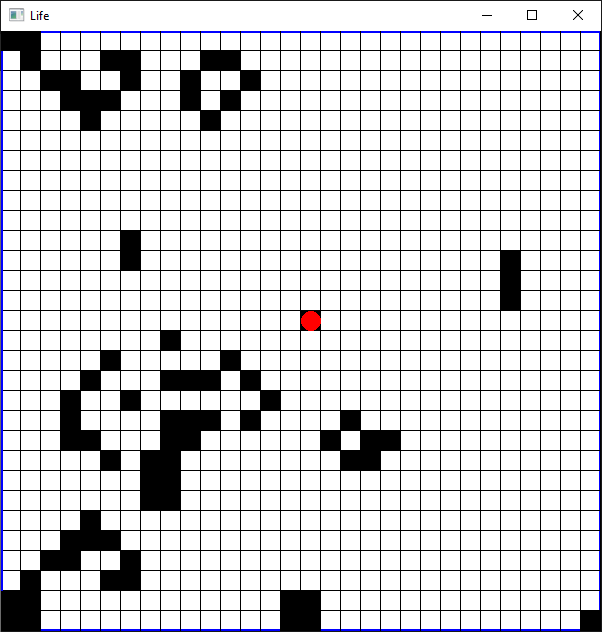

# Projeto Final - Jogo da Vida de Conway Interativo
#### Paradigmas de Programação Quadrimestre Suplementar - 2020 - Diurno
#### Bruno Sanches Rodrigues RA 11201721076



## 1. Descrição do Projeto
### 1.1 O Jogo da Vida
O Jogo da Vida é um autômato celular desenvolvido por John Conway, e <a href="https://www.ibiblio.org/lifepatterns/october1970.html">publicado na Scientific American em 1970</a>. O jogo original não tem interação com o jogador, e se desenvolve em um espaço 2D infinito contendo células com 2 estados: vivas ou mortas. A dinâmica do jogo é governada por regras simples que determinam se as células nascem, vivem ou morrem. Apesar das regras simples, o estado inicial do tabuleiro pode levar ao aparecimento de padrões complexos de células. <br>

As regras do Jogo da Vida são:
* Para uma célula com vida:
    * Se possui 0 ou 1 vizinho, morre de solidão.
    * Se possui 4 ou mais vizinhos, morre de superpopulação.
    * Se possui 2 ou 3 vizinhos, sobrevive.
* Para uma célula sem vida:
    * Se possui 3 vizinhos, passa a ter vida. 
<br>

### 1.2 Jogo da Vida Modificado
Este projeto de Programação Funcional em Haskell consiste em uma implementação modificada do Jogo da Vida, utilizando as bibliotecas <em>Gloss</em> para os gráficos e a interavidade e a biblioteca <em>Haskell Image Processing</em> para manipulação de imagens. A modificação implementada consiste na possibilidade de interação do jogador através de uma célula sempre viva que se move pelo tabuleiro de acordo com o pressionamento das teclas direcionais (<em>arrow keys</em>).

A atualização do tabuleiro é feita uma vez a cada tecla pressionada pelo jogador. Para rodar o jogo sem interatividade, pode-se pressionar a barra de espaço, que esconde a célula do jogador e atualiza o tabuleiro. 

O tabuleiro inicial pode ser gerado aleatoriamente, ou então pode-se escolher um dos tabuleiros predefinidos. Dentre eles, temos alguns dos padrões mais básicos: a espaçonave <em>glider</em>, o padrão estável <em>block</em> ou o oscilador <em>blinker</em>.

### 1.3 Implementação

Esta implementação utiliza a convolução de matrizes para realizar a atualização dos estados do tabuleiro, ideia retirada dessa <a href="http://greenteapress.com/complexity/html/thinkcomplexity008.html">implementação em Python</a>. O tabuleiro é representado como uma imagem de 1s e 0s, e então uma convolução é aplicada com um filtro quadrado de 9x9 pixels que soma o número de vizinhos de cada célula. Depois da convolução, um condicional aplicando as regras do jogo é aplicado, e a imagem resultante é o próximo estado do tabuleiro.

O projeto está dividido em 3 módulos. No módulo <em>Images</em> estão definidas funções para a manipulação de imagens, dentre elas a convolução que irá atualizar o tabuleiro e a função de geração de um tabuleiro aleatório. No módulo <em>Definitions</em> estão concentradas as definições de tipos auxiliares para os gráficos e para utilização da biblioteca <em>Gloss</em>. No módulo <em>Main</em> estão definidas as funções de: parâmetros iniciais da jogo, desenho do tabuleiro, tratamento da entrada do jogador, limitação do movimento do usuário, etc.

## 2. Instruções Para Execução

Para a execução simplificada do projeto (tabuleiro aleatório), pode-se rodar: 
```
stack run
```
Ou, para escolher o tabuleiro inicial, pode-se rodar:
```
stack run -- -p
```
E então digitar o nome de um dos tabuleiros <em>(random, block, glider, blinker, triangle)</em>.

Para jogar, ou interagir com o tabuleiro:
* Utilize as teclas direcionais (<em>arrow keys</em>) para mover a célula do jogador, representada pelo círculo vermelho.
* Utilize a barra de espaço para esconder a célula do jogador e assistir a evolução do tabuleiro.
* Utilize a tecla <em>escape</em> para sair do jogo.

## 3. Vídeo demonstrativo

Link para o vídeo demonstrativo no Youtube: <br>
<a href="https://youtu.be/kuIksCRZvSk">https://youtu.be/kuIksCRZvSk</a>

## 4. Desafios e Surpresas

O maior desafio do projeto foi a utilização da biblioteca <em>Haskell Image Processing</em> pelo sistema de tipos polimórficos dela, que, em conjunto com a representação de imagem que poderia ser paralelizada, resultou em inconsistências de tipo que foram difíceis de resolver nos estágios iniciais do projeto. Eventualmente esses problemas foram solucionados com a utilização da representação <em>VU - Vector Unboxed representation</em> ao invés de <em>RPU - Repa Parallel Unboxed array representation (computation done in parallel)</em>.

Trabalhar com a biblioteca <em> Gloss</em> foi mais intuitivo, e pude contar com um <a href="https://mmhaskell.com/blog/2019/3/25/making-a-glossy-game-part-1">tutorial muito útil</a>, além do próprio <a href="https://www.youtube.com/watch?v=jtgcJrDQR8U&feature=youtu.be">material da disciplina</a>.

A criação do tabuleiro aleatório exigiu certo trabalho para o entendimento do módulo <em> System.Random</em>, e do monada IO, mas essa parte foi bastante satisfatória.

O ideia inicial do projeto surgiu de uma <a href="https://www.youtube.com/watch?v=Z_zmZ23grXE&vl=es">releitura do Jogo da Vida com partículas livres</a>, em um espaço 2D, com interações similares a forças moleculares. Acabei optando por implementar um Jogo da Vida mais simples devido a atrasos em meu cronograma inicial de desenvolvimento do projeto.

A interação de uma célula controlada pelo jogador com o tabuleiro gerou padrões que considero bastante interessantes. Eu havia considerado também a utilização de mais de uma célula controlada pelo jogador, porém concluí que uma só célula já causa perturbações suficientes nas estruturas do tabuleiro.

## 5. Referências
<a href="https://hackage.haskell.org/package/gloss-1.13.2.1/docs/Graphics-Gloss.html">
Documentação da Biblioteca <em> Gloss </em> </a><br>
<a href="https://hackage.haskell.org/package/hip-1.5.6.0/docs/Graphics-Image.html"> 
Documentação da Biblioteca <em> Haskell Image Processing </em> </a><br>
<a href="http://learnyouahaskell.com/">
Livro <em> Learn You a Haskell </em> </a><br>
<a href="https://mmhaskell.com/blog/2019/3/25/making-a-glossy-game-part-1">
Tutorial de Criação de Jogos com <em>Gloss</em> </a><br>
<a href="https://playgameoflife.com/info">
Implementação online do Jogo da Vida</a><br>
<a href="http://greenteapress.com/complexity/html/thinkcomplexity008.html">
Capítulo 7 do Livro <em> Think Complexity </em> - Implementação do Jogo da Vida em Python</a><br>

